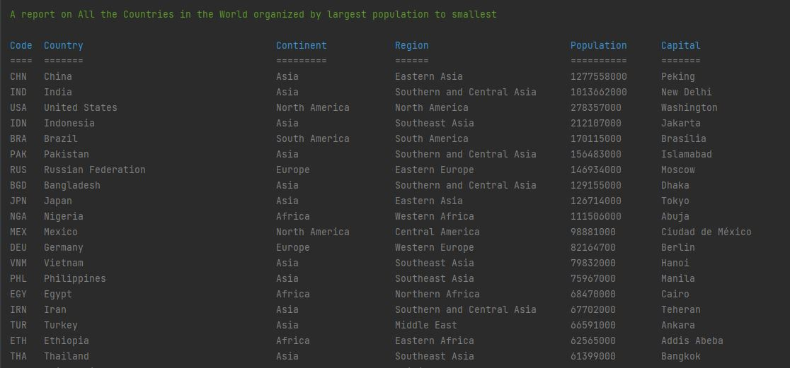

Group 5 course work project..

Testing Github actions.

Master Build Status: 

Develop Build Status: 

License: 

Release: 

Code Coverage: 

| ID  | Name                                                                                                                                           | Met | ScreenShot                                               |
|-----|------------------------------------------------------------------------------------------------------------------------------------------------|-----|----------------------------------------------------------|
| 1   | All the countries in the world organised by largest population to smallest.                                                                    | Yes |   |
| 2   | All the countries in a continent organised by largest population to smallest.                                                                  | Yes |   |
| 3   | All the countries in a region organised by largest population to smallest                                                                      | Yes |   |
| 4   | The top N populated countries in the world where N is provided by the user.                                                                    | Yes |   |
| 5   | The top N populated countries in a continent where N is provided by the user.                                                                  | Yes |   |
| 6   | The top N populated countries in a region where N is provided by the user.                                                                     | Yes |   |
| 7   | All the cities in the world organised by largest population to smallest.                                                                       | Yes |   |
| 8   | All the cities in a continent organised by largest population to smallest.                                                                     | Yes |   |
| 9   | All the cities in a region organised by largest population to smallest.                                                                        | Yes |   |
| 10  | All the cities in a country organised by largest population to smallest.                                                                       | Yes |  |
| 11  | All the cities in a district organised by largest population to smallest.                                                                      | Yes |  |
| 12  | The top N populated cities in the world where N is provided by the user.                                                                       | Yes |  |
| 13  | The top N populated cities in a continent where N is provided by the user.                                                                     | Yes |  |
| 14  | The top N populated cities in a region where N is provided by the user.                                                                        | Yes |  |
| 15  | The top N populated cities in a country where N is provided by the user.                                                                       | Yes |  |
| 16  | The top N populated cities in a district where N is provided by the user.                                                                      | Yes |  |
| 17  | All the capital cities in the world organised by largest population to smallest.                                                               | Yes |  |
| 18  | All the capital cities in a continent organised by largest population to smallest.                                                             | Yes |  |
| 19  | All the capital cities in a region organised by largest to smallest.                                                                           | Yes |  |
| 20  | The top N populated capital cities in the world where N is provided by the user                                                                | Yes |  |
| 21  | The top N populated capital cities in a continent where N is provided by the user.                                                             | Yes |  |
| 22  | The top N populated capital cities in a region where N is provided by the user.                                                                | Yes |  |
| 23  | The population of people, people living in cities, and people not living in cities in each continent.                                          | Yes |  |
| 24  | The population of people, people living in cities, and people not living in cities in each region.                                             | Yes |  |
| 25  | The population of people, people living in cities, and people not living in cities in each country.                                            | Yes |  |
| 26  | The population of the world.                                                                                                                   | Yes |  |
| 27  | The population of a continent.                                                                                                                 | Yes |  |
| 28  | The population of a region.                                                                                                                    | Yes |  |
| 29  | The population of a country.                                                                                                                   | Yes |  |
| 30  | The population of a district.                                                                                                                  | Yes |  |
| 31  | The population of a city.                                                                                                                      | Yes |  |
 | 32  | provide the number of people who speak Chinese, English, Hindi, Spanish and Arabic from greatest to smallest including population of the world. | Yes |  |